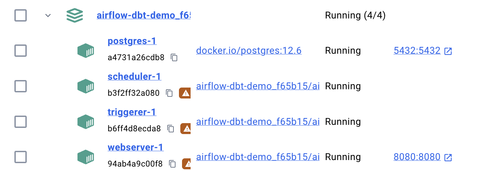
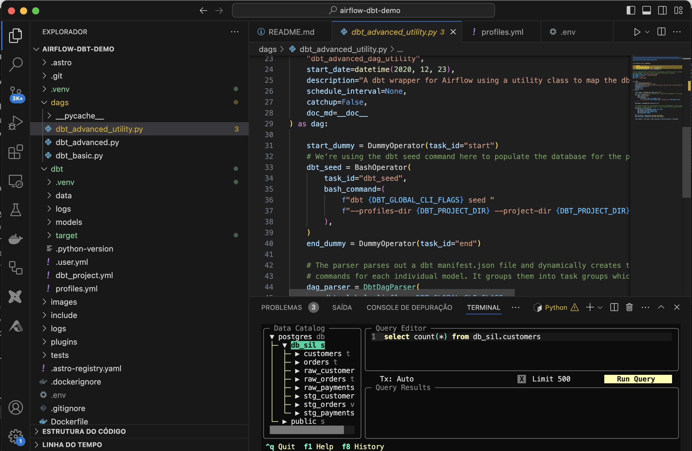
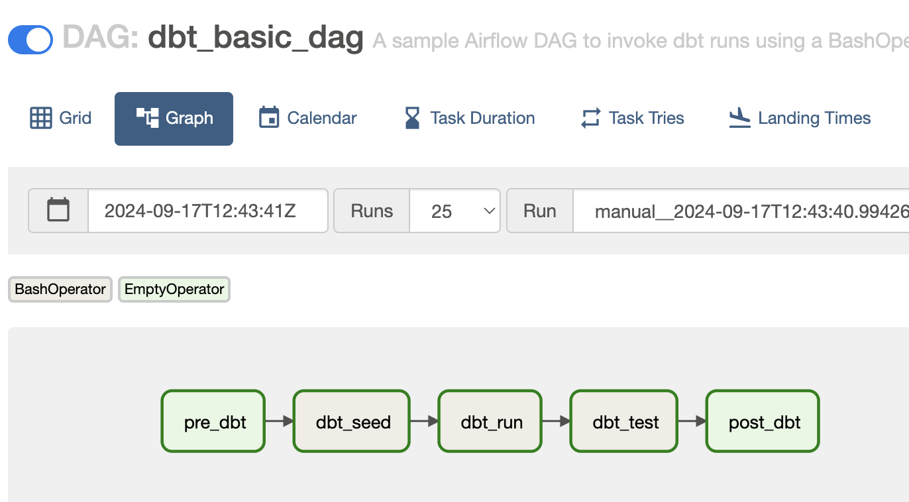
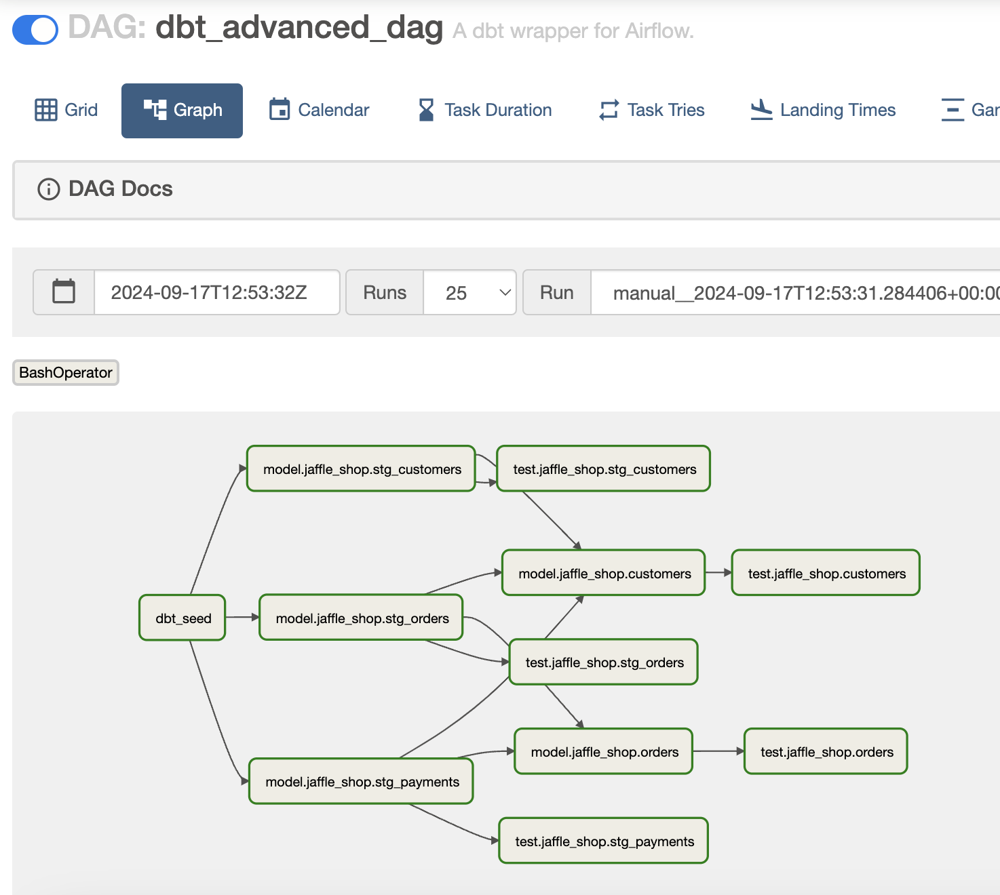
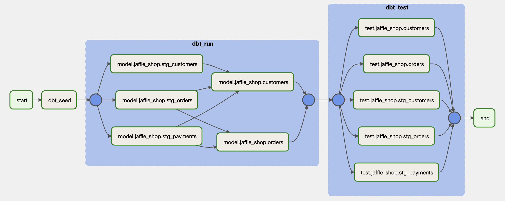
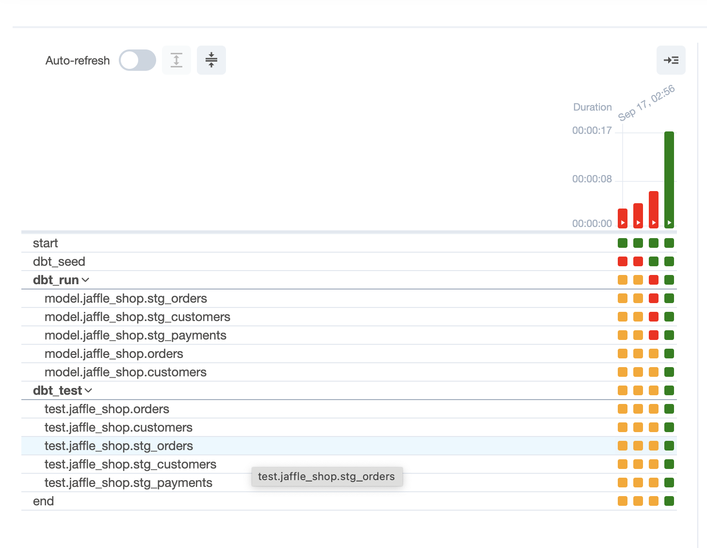

# Aiflow Schedule lab

In this lab I loaded data from some files into PostgreSQL and tested 3 ways of schedule using Airflow (Astro) with BashOperator.
I didn't start from scratch, I used [this repository](https://github.com/astronomer/airflow-dbt-demo) from Astronomer itself

## To run these DAGs locally:

1. Download the [Astro CLI](https://github.com/astronomer/astro-cli)
2. Download and run [Docker](https://docs.docker.com/docker-for-mac/install/)
3. Clone [this repository](https://github.com/Silmara-Basso/airflow-dbt-demo.git) and `cd` into it.
4. Activate the virtual environment
5. Create the .env wirh profiles.yml environmental variables
4. Run `astro dev start` to spin up a local Airflow environment and run the accompanying DAGs on your machine.

I used harlequin to view persisted data in Postgre
`pip install harlequin-postgres`

### With each form of implementation, the complexity increases, but it becomes easier to diagnose problems on a daily basis.

1) Basic Dag (dbt_basic_dag) - Without many visual details of the executions

2) Advanced (dbt_advanced_dag) - We can see the details of what was executed, but everything is a bit mixed up

3) Advanced with explode (dbt_basic_dag_utility) - In this case we have separate executions and tests, it is easier to analyze.

Shows how to parse a dbt manifest file to "explode" the dbt DAG into Airflow
Each dbt model is run as a bash command.

## Notes
- To use these DAGs, Airflow 2.2+ is required. These DAGs have been tested with Airflow 2.2.0.
- If you make changes to the dbt project, you will need to run `dbt compile` in order to update the `manifest.json` file.
This may be done manually during development, as part of a CI/CD pipeline, or as a separate step in a production pipeline
run *before* the Airflow DAG is triggered.
- To destroy the lab environment use `astro dev kill`

